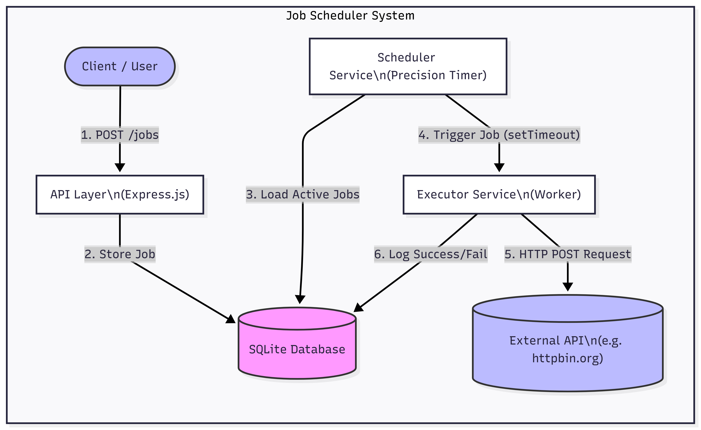

# High-Throughput Job Scheduler

A scalable job scheduler system capable of executing thousands of scheduled jobs per second with high accuracy and reliability.

## 🎯 System Overview

The scheduler supports the following capabilities:
1. **Create jobs** with CRON-like schedules
2. **Modify existing jobs** (update schedule, API endpoint, or execution type)
3. **View execution history** for any job (last 5 executions by default)
4. **Alert on job failures** (console logging with execution details)

## 🏗️ System Design

### Architecture



The system follows a layered architecture with clear separation of concerns:

- **API Layer** (`src/routes/`): REST endpoints for job management and observability
- **Service Layer** (`src/services/`): Scheduler engine and executor with retry logic
- **Data Layer** (`src/models/`, `src/database/`): Job and execution persistence using SQLite

### Core Components

1. **Scheduler Service**: Parses CRON expressions, calculates next execution times, executes jobs every 100ms
2. **Executor Service**: Executes HTTP POST requests with at-least-once semantics (exponential backoff retry)
3. **Database**: SQLite with normalized tables for jobs and executions (indexed for fast queries)

### Technology Stack

- **Runtime**: Node.js (v18+)
- **Database**: SQLite
- **HTTP Client**: Axios
- **Scheduling**: Custom scheduler with 100ms precision loop

## 🔄 Data Flow

1. **Job Creation**: Client → API → Database → Scheduler (job scheduled)
2. **Job Execution**: Scheduler → Executor → HTTP POST → Database (execution logged)
3. **Query Executions**: Client → API → Database → Response

## 📡 API Design

### Required APIs

#### 1. Create Job

**Endpoint**: `POST /api/jobs`

**Request Body**:
```json
{
  "schedule": "31 10-15 1 * * MON-FRI",
  "api": "https://localhost:4444/foo",
  "type": "ATLEAST_ONCE"
}
```

**Response**:
```json
{
  "jobId": "uuid-here",
  "status": "created",
  "message": "Job created successfully"
}
```

#### 2. Get Job Executions

**Endpoint**: `GET /api/jobs/:jobId/executions?limit=5`

Returns the last 5 executions (default) for a given jobId. Each execution includes:
- Execution timestamp
- HTTP response status
- Execution duration
- Execution status (success/failure)
- Error details (if any)

**Response**:
```json
{
  "jobId": "uuid-here",
  "executions": [
    {
      "executionId": "exec-uuid",
      "timestamp": "2025-12-28T10:15:31.000Z",
      "status": "success",
      "httpStatus": 200,
      "duration": 1234,
      "error": null
    }
  ]
}
```

#### 3. Observability / Debug APIs

- `GET /api/metrics` - System metrics (total executions, success rate, average delay, active jobs)
- `GET /api/health` - Health check (status, uptime, scheduler state)
- `GET /api/jobs` - List all jobs
- `GET /api/jobs/:jobId` - Get job details
- `GET /api/stats` - Detailed statistics (scheduler + database metrics)
- `GET /api/executions` - Get all executions (with optional limit query param)

### Additional APIs

- `PUT /api/jobs/:jobId` - Update job (supports partial updates)
- `DELETE /api/jobs/:jobId` - Delete job

## 🚀 Quick Start

### Prerequisites
- Node.js (v18 or higher)
- npm

### Installation

```bash
# Install dependencies
npm install

# Initialize database
npm run init-db

# Start server
npm start
```

Server runs on `http://localhost:3000`

### Testing

```bash
# Run automated tests
npm run test-api

# Create sample data
npm run sample-data
```

## 📊 Functional Requirements

✅ **High-Throughput**: Supports thousands of job executions per second through async, non-blocking execution

✅ **CRON-like Schedule**: Modified CRON spec with second-level granularity (format: `second minute hour day month dayOfWeek`)

✅ **At-Least-Once Semantics**: Retry logic with exponential backoff ensures jobs execute at least once

✅ **Persistence**: All jobs and execution history stored in SQLite database

✅ **Minimal Drift**: 100ms execution loop precision minimizes schedule deviation even under load

✅ **Long-Running Requests**: Handles API invocations that may take seconds without blocking other jobs

## 🔧 Non-Functional Requirements

### Architecture
- **Separation of Concerns**: Clear API, Service, and Data layers
- **Modular Design**: Independent, testable components
- **Error Handling**: Comprehensive error handling and validation
- **Code Quality**: Clean, maintainable code structure

### Scalability
- **Concurrent Execution**: Async execution allows thousands of jobs per second
- **Precise Scheduling**: 100ms loop ensures minimal schedule drift
- **Efficient Queries**: Indexed database queries for fast execution lookups
- **Memory Optimization**: Jobs kept in memory for fast access; database for persistence

### Observability
- **Logging**: Comprehensive request and execution logging
- **Metrics**: Real-time metrics (success rate, execution count, average delay)
- **Execution History**: Complete audit trail of all job executions
- **Health Checks**: System health and status monitoring

## 🔒 Trade-offs & Limitations

### Current Implementation
- **Single Process**: All jobs run in one Node.js process (suitable for thousands of jobs)
- **SQLite**: Simple and sufficient for development; production should use PostgreSQL/MySQL for better concurrency
- **In-Memory Scheduler**: Fast execution but scheduler state lost on restart (jobs reloaded from DB on startup)
- **Console Alerts**: Job failures logged to console; production should integrate email/Slack/webhooks

### Production Recommendations
- Use PostgreSQL/MySQL for better concurrency and reliability
- Implement worker processes/containers for horizontal scaling
- Add distributed locking for multi-instance deployments
- Integrate proper alerting (email, Slack, PagerDuty)
- Add rate limiting and authentication
- Implement job prioritization and queues

## 🐳 Docker Support

```bash
# Using Docker Compose
docker-compose up --build

# Or using Docker directly
docker build -t job-scheduler .
docker run -p 3000:3000 job-scheduler
```

## 📝 Job Specification Format

```json
{
  "schedule": "31 10-15 1 * * MON-FRI",
  "api": "https://localhost:4444/foo",
  "type": "ATLEAST_ONCE"
}
```

**Schedule Format**: `second minute hour day month dayOfWeek`
- Example: `"31 10-15 1 * * MON-FRI"` executes at 31st second of every minute between 01:10-01:15 AM every day of the month, every month, Monday-Friday

**Type**: `ATLEAST_ONCE` (retries on failure) or `EXACTLY_ONCE` (no retries)
